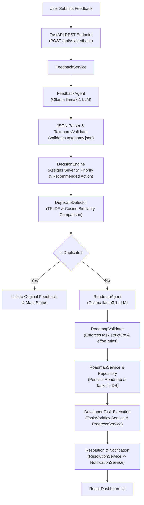

# ProductIQ — Architecture, Data Flow & System Components Documentation

ProductIQ is an enterprise-grade, AI-driven Product Intelligence & Developer Resolution platform. It transforms raw customer feedback and bug reports into structured AI taxonomy classifications, detects duplicate issues using vector similarity algorithms, automatically generates developer roadmaps with actionable tasks, tracks progress, and manages issue resolutions.

---

## 1. System Overview & Technology Stack

| Layer | Technologies / Frameworks | Key Responsibilities |
| :--- | :--- | :--- |
| **Frontend UI** | React 18, TypeScript, Vite 8, TailwindCSS, Lucide Icons, React Router v6 | Enterprise dark SaaS dashboard, real-time analytics, feedback submission with live step loader, custom dropdown controls, user authentication, profile settings. |
| **Backend REST API** | FastAPI, Uvicorn, Pydantic v2 | RESTful API endpoints (`/api/v1`), health checks, CORS policy, request validation, CORS middleware. |
| **Database & Persistence** | PostgreSQL 16 / SQLAlchemy 2.x ORM, Alembic Migrations | Persistent database storage for feedback, roadmaps, developer tasks, and system notifications. Includes automatic fallback resilience to `sqlite:///productiq_dev.db`. |
| **AI Intelligence Engine** | Ollama local runner with `llama3.1` model | Local LLM inference for feedback classification, taxonomy validation, duplicate scoring, and developer roadmap generation. |

---

## 2. End-to-End Data Flow & Pipeline Architecture



---

## 3. Backend Phase-by-Phase Architecture

### Phase 1: Foundation Stabilization & AI Client
- **Taxonomy Engine** (`app/taxonomy/taxonomy.json`): Authoritative taxonomy definition covering categories (`Bug Report`, `Feature Request`, `Performance Feedback`, `UX / Usability`, etc.) and subcategories (`Authentication / Login`, `Data Loss / Corruption`, `Latency / Slow Load`, etc.).
- **Taxonomy Validator** (`app/taxonomy/validator.py`): Validates that AI classification strictly adheres to authoritative taxonomy values.
- **Ollama Client** (`app/llm/ollama_client.py`): Asynchronous client communicating with local `llama3.1` model, featuring automatic retries and JSON mode enforcement.
- **JSON Parser** (`app/utils/json_parser.py`): Robust parser that extracts clean JSON payloads from model output strings.

### Phase 2: PostgreSQL & SQLAlchemy Persistence Layer
- **Database Engine & Resilience** (`app/database/db.py`): Connection manager configured with primary PostgreSQL support (`postgresql+psycopg://...`) and seamless automatic fallback to persistent SQLite (`sqlite:///productiq_dev.db`) with 10-second health caching to eliminate timeout latency.
- **Database Models** (`app/models/`):
  - `Feedback`: Stores raw user feedback, classification result, priority, severity, and status.
  - `Roadmap`: Stores roadmap title, description, effort rating, calculated overall progress %, and status.
  - `RoadmapTask`: Stores developer tasks, progress %, status, dependencies, and acceptance criteria.
  - `Notification`: System alerts generated upon issue resolution.
- **Repositories** (`app/repositories/`): Clean data access object pattern for all database entities.

### Phase 3: Feedback Agent & Decision Engine
- **FeedbackAgent** (`app/agents/feedback_agent.py`): Formulates structured classification prompts for `llama3.1` and converts output into validated Pydantic schemas.
- **DecisionEngine** (`app/engine/decision_engine.py`): Deterministic rules engine that evaluates feedback category and severity to assign priority (`P0 - Blocker`, `P1 - High`, `P2 - Medium`, `P3 - Low`) and recommended resolution steps.
- **FeedbackService** (`app/services/feedback_service.py`): Orchestrates the complete ingestion, classification, duplicate check, decision assignment, and roadmap generation pipeline.

### Phase 4: Duplicate Detection & Roadmap Generator
- **DuplicateDetector** (`app/engine/duplicate_detector.py`): Calculates TF-IDF vectors and Cosine Similarity across existing database records to detect candidate duplicate issues (threshold `0.75`).
- **RoadmapAgent** (`app/agents/roadmap_agent.py`): Generates structured developer implementation plans containing 3–5 actionable tasks with acceptance criteria.
- **RoadmapValidator** (`app/validators/roadmap_validator.py`): Ensures generated roadmaps satisfy structural constraints and non-negative effort ratings.

### Phase 5: Developer Workflow, Progress & Resolution
- **TaskWorkflowService** (`app/services/task_workflow_service.py`): Manages developer task status updates (`Open` → `In Progress` → `Resolved`).
- **ProgressService** (`app/services/progress_service.py`): Recalculates overall roadmap progress percentage based on developer task updates.
- **ResolutionService** (`app/services/resolution_service.py`): Automatically marks parent feedback items as `Resolved` when all associated roadmap tasks hit 100%.
- **NotificationService** (`app/services/notification_service.py`): Emits real-time notification alerts when issues are resolved.

### Phase 6: REST API Layer
- **FastAPI Core** (`app/main.py`): Entry point with CORS middleware, exception handlers, and API router.
- **API Endpoints** (`app/api/routes/`):
  - `GET /api/v1/health`: Checks FastAPI, database, and Ollama status.
  - `POST /api/v1/feedback`: Submits feedback for AI processing.
  - `GET /api/v1/feedback`: Paginated listing with multi-field search and filters.
  - `GET /api/v1/feedback/{id}`: Returns unified feedback details, duplicate score, and roadmap.
  - `GET /api/v1/roadmaps`: Returns all product roadmaps.
  - `PATCH /api/v1/tasks/{id}`: Updates developer task progress and status.
  - `GET /api/v1/dashboard/summary`: Summary metrics for dashboard charts.
  - `GET /api/v1/notifications`: List system notifications.

---

## 4. Frontend Architecture & Component Directory

```
frontend/src/
├── App.tsx                        # Router root & ProtectedRoute wrapper
├── context/
│   └── AuthContext.tsx           # User session management & local storage
├── components/
│   ├── common/
│   │   ├── CustomDropdown.tsx    # Animated interactive dropdown menu
│   │   ├── StatCard.tsx          # Metric highlight counter card
│   │   ├── Badge.tsx             # Status, priority & severity pills
│   │   ├── ProgressBar.tsx       # Animated progress bar fill
│   │   └── EmptyState.tsx        # Fallback view for empty lists
│   ├── layout/
│   │   ├── Layout.tsx            # Main shell container
│   │   ├── Header.tsx            # Search bar, API health pill, profile menu
│   │   └── Sidebar.tsx           # Sidebar navigation menu
│   ├── feedback/
│   │   ├── FeedbackTable.tsx     # Filterable feedback table view
│   │   └── FeedbackCard.tsx      # Individual feedback summary card
│   └── roadmap/
│       ├── RoadmapCard.tsx       # Roadmap summary card with progress bar
│       └── TaskCard.tsx          # Interactive developer task update card
├── pages/
│   ├── LoginPage.tsx             # Enterprise auth, password toggle, Google Sign-In
│   ├── ProfilePage.tsx           # User profile, edit settings, change password
│   ├── DashboardPage.tsx         # KPI overview, feedback & roadmap analytics
│   ├── FeedbackListPage.tsx      # Feedback repository with multi-filters
│   ├── SubmitFeedbackPage.tsx    # Feedback submission & AI step progress loader
│   ├── FeedbackDetailPage.tsx    # Unified analysis view (AI result + Duplicate + Roadmap)
│   ├── RoadmapsPage.tsx          # Product roadmaps grid
│   ├── RoadmapDetailPage.tsx     # Roadmap task execution board
│   └── NotificationsPage.tsx     # Resolution alerts feed
└── services/
    └── api.ts                    # Axios API client connecting to FastAPI backend
```

---

## 5. Key Application Flows & Features

### 1. Enterprise Authentication (`/login`)
- **Login Options**: Email/Password login, **Continue with Google** Single Sign-On, and **Quick Demo Login** (`Product Manager` or `Lead Engineer`).
- **Password Visibility**: Interactive `Eye` / `EyeOff` show/hide password toggle.
- **Session State**: Session saved in `localStorage` (`productiq_user`).

### 2. Feedback Ingestion & AI Step Progress Loader (`/feedback/new`)
- Submitting feedback opens a live processing overlay with a pulsing circuit loader (`Cpu`) and animated step progress checklist:
  - *Step 1*: Understanding raw feedback input
  - *Step 2*: Classifying category & severity via `llama3.1`
  - *Step 3*: Checking duplicate candidate records
  - *Step 4*: Generating developer roadmap & task workflow
- Automatically navigates to `/feedback/{id}` upon completion.

### 3. Interactive Custom Dropdowns (`CustomDropdown.tsx`)
- Custom animated dropdown menus with opening scale/fade animation, hover highlights, active selection checkmark, and click-outside handler.
- Replaces native browser `<select>` controls across Feedback filters, Submit platform selection, Task status updates, and Profile role selection.

### 4. Developer Workflow & Automated Resolution (`/roadmaps/{id}`)
- Updating developer task status or progress percentage automatically recalculates overall roadmap completion via `ProgressService`.
- When all roadmap tasks hit 100%, `ResolutionService` automatically updates the parent feedback status to `Resolved` and sends an alert to `NotificationsPage`.

---

## 6. Verification & Operational Commands

- **Run Backend Test Suite** (100 passing tests):
  ```bash
  python -m pytest -q
  ```
- **Build Production Frontend**:
  ```bash
  cd frontend && npm run build
  ```
- **Run Backend Dev Server**:
  ```bash
  venv\Scripts\python.exe -m uvicorn app.main:app --host 127.0.0.1 --port 8000
  ```
- **Run Frontend Dev Server**:
  ```bash
  cd frontend && npm run dev
  ```
